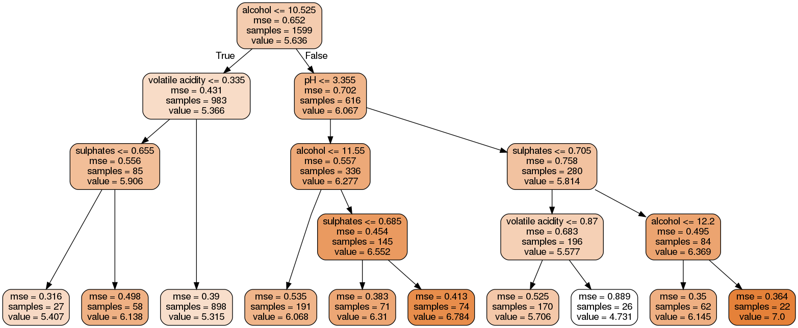
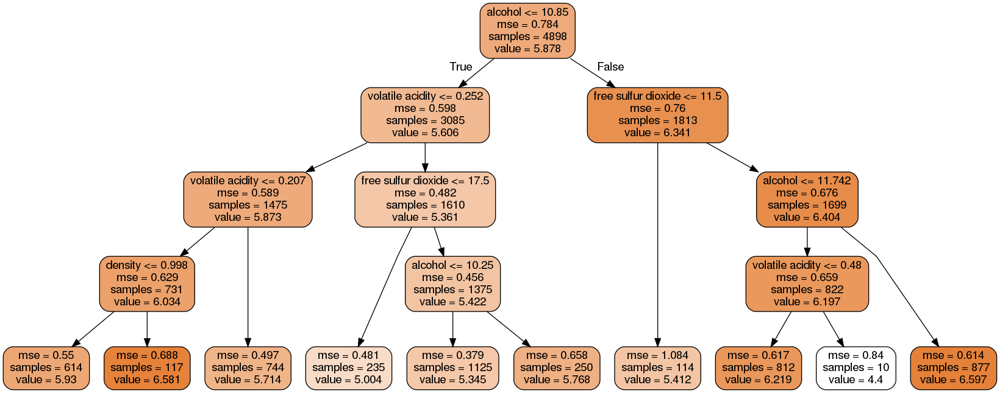
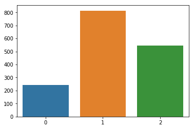
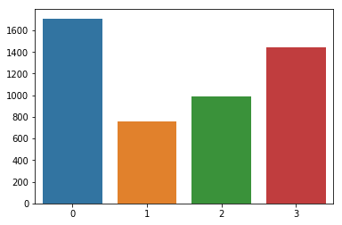

# Wine Quality Dataset Analysis

#### Academic citation: 
>P. Cortez, A. Cerdeira, F. Almeida, T. Matos and J. Reis.
>Modeling wine preferences by data mining from physicochemical properties. In Decision Support Systems, Elsevier, 47(4):547-553, 2009.

## Objectives and assumptions
My objectives are based around my own desire to have some ability to pick good quality wines. There's a lot of detailed information and sophisticated advice about this sort of thing available for anyone willing to use a search engine, but I thought 'why not see if ML can tell me anything?' As a secondary interest, I wanted to see how useful trees are for making explainable models. 
#### Objectives
I will frame the objectives of this analysis as the answers to questions. Those questions are: 
1. What are the most important factors in making good quality (6+) wine? (So I can pick good wines)
2. What are the most important factors in making poor quality (4-) wine? (So I can avoid bad wines)
3. What is the most popular type of wine? (Less a matter of practicality, more curiosity)
4. How well can the quality of wine be predicted from physicochemical measurements? (Should I ever have access to any similar datasets about wines available to me)

#### Assumptions
1. That not all features contribute equally to quality. 
2. That markets work to the degree such that the most popular types of wine are demanded more, and therefore are supplied more. 
3. The data is an accurate sampling of wines in Portugal in 2009. 
4. That human taste in wine is strongly affected by the physicochemical properties of wine. 
5. That the quality ratings of expert wine tasters would correlate with the quality ratings of casual wine drinkers. 

## EDA
The EDA found nothing significant that suggests I should remove any features, or that I would have any significant difficulty with any of them. They're all numerical and there's no missing data. Nothing in the initial EDA answers any of the objective-questions, though the low linear correlations between the target variable and all the prediction variables is vaguely suggestive of the answer to objective-question 4 being 'poorly'. 

One particular thing of interest that I have noticed is that the scores all lie in the range 3-9 (3-8 for when considering red wine alone). This effectively makes the quality scale 1-7 for white wine and 1-6 for red wine. 

## Questions 1 & 2
1. What are the most important factors in making good quality (6+) wine?
2. What are the most important factors in making poor quality (4-) wine?

### (Shorter) Red Wine Decision Tree

#### What answers to questions 1 and 2 does this graph give?
In the above graph there are 9 decisions; 3 alcohol, 3 sulphates, 2 volatile acidity, and one pH.

In all 3 decisions, a greater amount of alcohol lead toward higher predicted scores for the wine, with the highest amount of alcohol leading to the highest predicted score. This suggests that for making good quality wine, making it _strong_ (higher alcohol content compared to the average) is a good idea.

Similarly, in all 3 decisions about sulphates, the higher amount of sulphates lead to the higher predicted quality scores. Sulphates are used as preservatives in many foodstuffs, including wine. This suggest that using sulphates in wine improves the quality, perhaps by preserving it.

2 decisions were about volatile acidity, where in both cases a lower reading of volatile acidity lead to the higher predictions of quality. Volatile acidity is what increases as wine turns to vinegar. This suggests that it's a good idea to keep the wine from turning, either by some manufacturing process, or by adding perservatives.

1 decision was about pH, which is a measure of acidity, and can be interpreted as being similar to volatile acidity for the purposes of determining what factors determine the quality of wine.

From the above, I infer that the main indicators of high quality wine are that it is strong (high alcohol content), and fresh (or properly preserved). 
### (Shorter) White Wine Decision Tree

#### What answers to questions 1 and 2 does this graph give?
As for red wine, there were 9 decisions in the tree, with 3 of them were for alcohol. Again, more alcohol lead to higher quality score predictions. This supports the above inference of strong wine being higher quality.

There were 3 decisions about volatile acidity, and in all three cases, higher acidity (which comes from the wine turning to vinegar over time) lead to lower predictions of quality. This supports the above inference of fresher wine being of higher quality.

Free sulfur dioxide comes up in 2 decisions. In both cases higher amounts of free sulful dioxide lead to higher estimates of quality. This supports the above inference of fresher wine being of higher quality, in this case via the use of preservatives.

There was one decision based on density, where lower density lead to lower quality. I am unable to draw any useful inference from this. 

### Answers
Overall, the most two most important factors in the quality of a wine turned out to be it's alcohol content (higher is better) and it's acidity (lower is better). Secondarily, the amount of preservatives used were shown to be important. Since wine becomes more acidic as it ages (and eventually turns to vinegar of variable quality), I interpreted this to mean the prevention of the process which makes the wine more acidic contributes to the preservation of quality in wine. 

> When I next have to buy a bottle (at least when it's Portuguese), I'll go for something strong and young (or with extra preservatives in).

## Question 3
3. What is the most popular type of wine?
To start with, what types of wine are there? Based purely off the size of each dataset, white wine is more popular than red wine. Within each dataset, I'd have to discover what types were definable via physicochemical measurements. I decided that kMeans clustering was the best way to automatically determine types. 
##### Red wine
First, I needed to find out the optimal value for k. I used gridsearch to perform a controlled experiment, with k being varied between 1 and 15. After plotting the resulting mean errors, I saw that 3 was a good choice for k. 

**Type 0**, having: lower *fixed acidity*, higher *volatile acidity*, more *residual sugar*, higher *total sulful dioxide*, and less *alcohol*  
**Type 1**, having: less *free sulfur dioxide*, and lower *total sulful dioxide*  
**Type 2**, having: a mid(ish) amount of *total sulfur dioxide*, and more *sulphates*

But which of the three types was the most popular? 

Type 0 size: 241
Type 1 size: 814
Type 2 size: 544

> For red wine, Type 1 wins, making the most popular red wine the one with the least preservatives in. 

##### White wine
The optimal value of k for white wine was 4. 

**Type 0**, having: lower *everything*, except for *pH* and *alcohol*, which are higher  
**Type 1**, having: higher *everything*, except for *pH* and *alcohol*, which are lower  
**Type 2**, having: lower *everything*, except for *alcohol*, which is higher  
**Type 3**, having: higher *everything*, except for *alcohol* which is lower  

But which of the three types was the most popular? 

Type 0 size: 1710
Type 1 size: 756
Type 2 size: 992
Type 3 size: 1440

> For white wine, Type 0 wins, making the most popular white wine one with the higher acidity and alcohol. Type 3 is a close second, and is defined by lower alcohol. 

Interestingly, this shows that wines with attributes that experts consider to be a negative, are the most common types of wine. 

## Question 4
4. How well can the quality of wine be predicted from physicochemical measurements?

Using Support Vector Machines, the best results had Mean Absolute Errors of between 0.36 (for red wine) and 0.37 (for white wine). That's less than the rounding difference between two different quality scores, which is good enough for me. 

Fortunately, that is better than the obligatory linear regression benchmark; 
- Red Wine Mean Absolue Error: 0.502297
- White Wine Mean Absolute Error: 0.587126